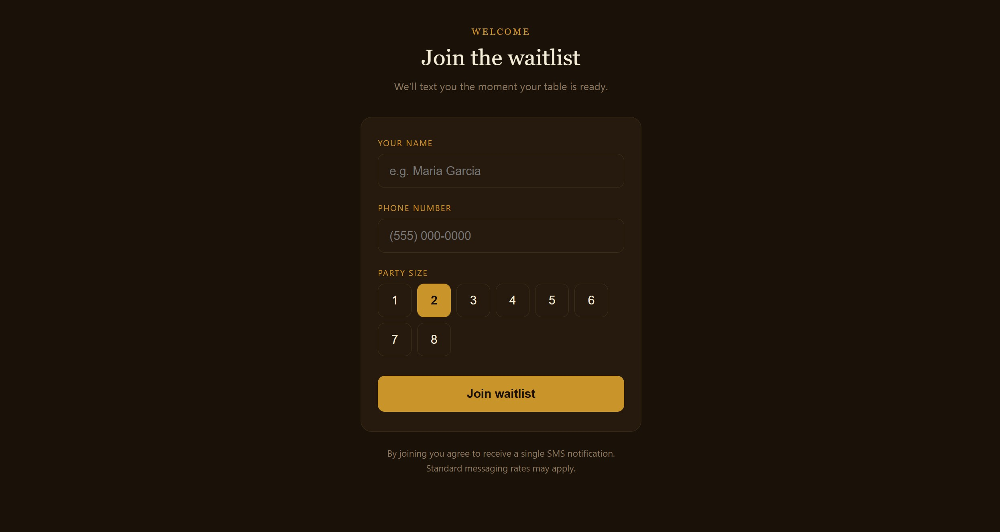
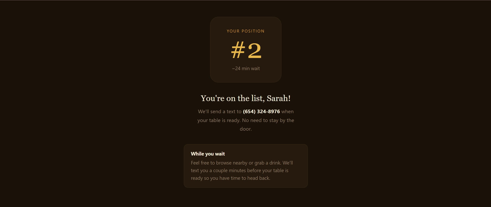
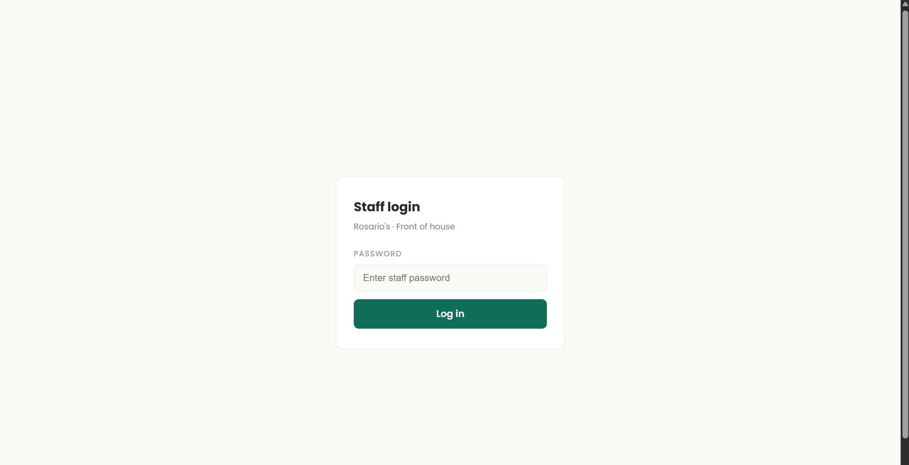
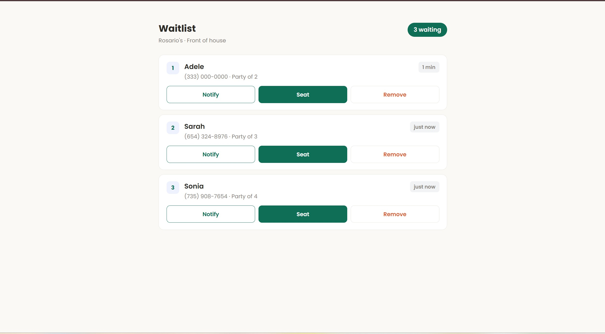
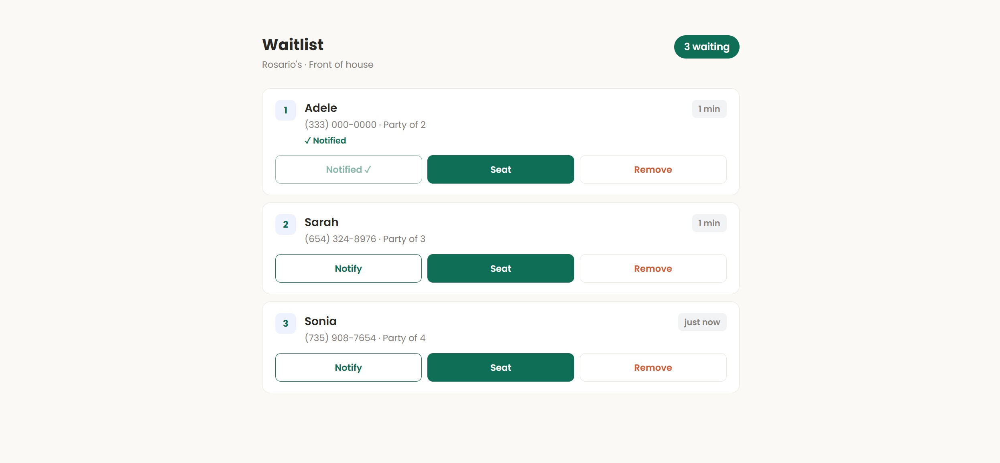
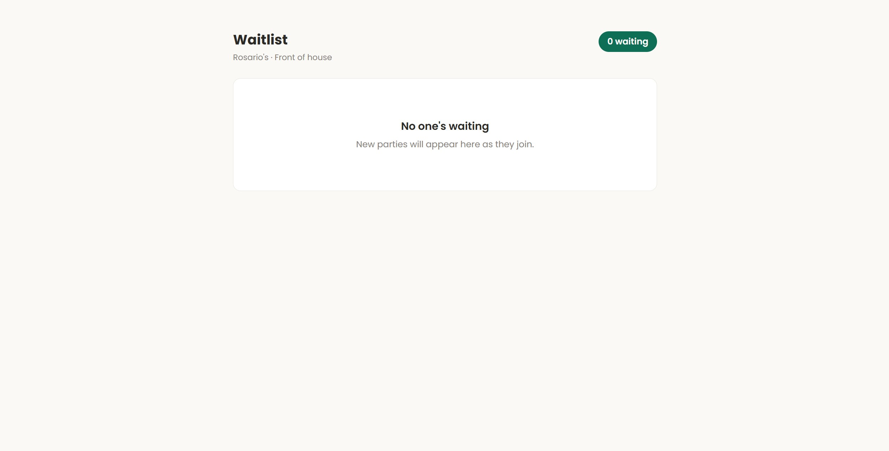

# Restaurant Waitlist App

A full-stack digital waitlist system for restaurants. Customers join via a QR code and receive an SMS notification when their table is ready. Staff manage the live queue from a secure dashboard.

## Features

## Screenshots

### Customer join page


### Customer queue position


### Staff login


### Staff dashboard with queue


### Notified state


### Empty queue


### Customer
- Scan a QR code to open the join page on their phone
- Enter name, phone number, and party size
- See their position in the queue instantly after joining
- Receive an SMS when their table is ready (AWS Phase)

### Staff
- Secure password-protected login
- View the live waitlist in real time (auto-refreshes every 10 seconds)
- Mark a party as seated — removes them from the queue
- Remove a party manually
- Send a table-ready notification to a customer
- Visual indicator for long waits (20+ minutes highlighted in amber)
- "Notified ✓" state on the button after notification is sent

## Tech Stack

| Layer | Technology |
|---|---|
| Customer frontend | React + Vite |
| Staff frontend | React + Vite |
| Backend API | Node.js + Express |
| Database | PostgreSQL |
| Local dev environment | Docker + Docker Compose |
| Cloud deployment (planned) | AWS |

## Project Structure
```
restaurant-waitlist/
├── customer-app/        # Customer-facing join page (React)
├── staff-app/           # Staff dashboard (React)
├── backend/             # Express REST API
│   └── src/
│       ├── routes/
│       │   └── waitlist.js
│       ├── db/
│       │   └── index.js
│       └── index.js
└── docker-compose.yml   # Runs all 4 services locally
```

## Running This App on Your Device

### Prerequisites

Make sure you have the following installed:

- [Docker Desktop](https://www.docker.com/products/docker-desktop) — required to run all services
- [Node.js + npm](https://nodejs.org) — LTS version recommended
- [Git](https://git-scm.com) — to clone the repo
- [AWS CLI](https://aws.amazon.com/cli/) — configure with dummy credentials for local dev (no real AWS account needed)

### Step 1: Configure AWS CLI (one time only)

```bash
aws configure set aws_access_key_id local
aws configure set aws_secret_access_key local
aws configure set region us-east-1
```

### Step 2: Clone the repo

```bash
git clone https://github.com/annikabhatia/restaurant_waitlist.git
cd restaurant_waitlist
```

### Step 3: Start everything with Docker

```bash
docker compose up --build
```

This starts all 4 services automatically:
- PostgreSQL database on port 5432
- Express backend on port 3000
- Customer app on port 5173
- Staff dashboard on port 5174

### Step 4: Create the database table (first time only)

In a new terminal:

```bash
docker exec -it postgres-local psql -U admin -d waitlist
```

Then paste this SQL and press Enter:

```sql
CREATE TABLE waitlist_entries (
  id UUID PRIMARY KEY DEFAULT gen_random_uuid(),
  name VARCHAR(100) NOT NULL,
  phone VARCHAR(15) NOT NULL UNIQUE,
  party_size INTEGER NOT NULL CHECK (party_size BETWEEN 1 AND 8),
  status VARCHAR(20) NOT NULL DEFAULT 'waiting',
  joined_at TIMESTAMP NOT NULL DEFAULT NOW()
);
```

Then type `\q` to exit.

### Step 5: Open the app

- **Customer join page:** http://localhost:5173
- **Staff dashboard:** http://localhost:5174

### Staff login

Password: `rosarios2024`

### Stopping the app

```bash
docker compose down
```

### Clearing test data

```bash
docker exec -it postgres-local psql -U admin -d waitlist -c "DELETE FROM waitlist_entries;"
```

## API Routes

| Method | Route | Auth | Description |
|---|---|---|---|
| POST | `/waitlist/join` | Public | Add a new party to the waitlist |
| GET | `/waitlist/status/:phone` | Public | Get queue position by phone number |
| GET | `/waitlist` | Staff | Get all waiting parties |
| PATCH | `/waitlist/:id/seat` | Staff | Mark a party as seated |
| DELETE | `/waitlist/:id` | Staff | Remove a party from the queue |
| POST | `/waitlist/:id/notify` | Staff | Send a table-ready notification |

## Database Schema

```sql
waitlist_entries
├── id          UUID PRIMARY KEY (auto-generated)
├── name        VARCHAR(100) NOT NULL
├── phone       VARCHAR(15) NOT NULL UNIQUE
├── party_size  INTEGER (1-8)
├── status      VARCHAR(20) DEFAULT 'waiting'
└── joined_at   TIMESTAMP DEFAULT NOW()
```

## Roadmap

### Phase 1: Local build ✅
- [x] Project structure and Git/GitHub setup
- [x] PostgreSQL database with waitlist schema
- [x] Express backend with all 5 API routes
- [x] Customer join page — name, phone, party size, confirmation screen
- [x] Staff dashboard — live queue, seat/remove/notify actions
- [x] Basic staff authentication (password gate)
- [x] Duplicate phone number error handling
- [x] Containerized with Docker — full stack runs with `docker compose up`
- [x] Notify button with "Notified ✓" state

### Phase 2: Polish ✅
- [x] All 7 backend tests passing
- [x] Screenshots added to README
- [x] Known limitations documented
- [x] Setup instructions for running on any device

### Phase 3: AWS Migration ⬜
- [ ] Create AWS account
- [ ] PostgreSQL → Amazon RDS
- [ ] Express routes → AWS Lambda handlers
- [ ] API Gateway to expose Lambda functions
- [ ] Customer app → S3 + CloudFront
- [ ] Staff app → S3 + CloudFront
- [ ] Password gate → Amazon Cognito
- [ ] Console.log stub → Amazon SNS (real SMS)
- [ ] Live queue position updates via WebSocket (API Gateway WebSocket)
- [ ] Set up AWS billing alerts

### Phase 4: Showcase ⬜
- [ ] End-to-end testing on real AWS infrastructure
- [ ] Final README with live demo link and architecture diagram
- [ ] Project write-up for resume and LinkedIn

## About

Built as a self-directed full-stack engineering project to gain hands-on experience with React, Node.js, PostgreSQL, Docker, and AWS. Designed to mirror the kind of work done in a software engineering internship — including git workflow, containerization, API design, and cloud deployment planning.